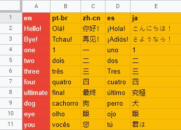
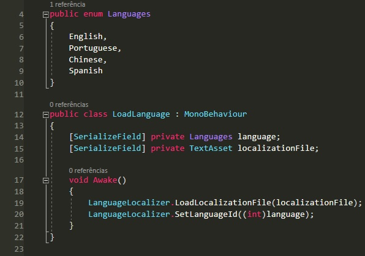

# Localization For Unity by Varollo
**version 1.0.2**

This is a .csv based localization system for Unity.

## How to use it
The .csv file must be organized in a specific way, with each frase separated by rows and languages by colums.

Save the spreadsheet as .csv to use it in your game.

When you want to load the localization file, use:

> LanguageLocalizer.LoadLocalizationFile(file)

Where file is a TextAsset file, being your localization spreadsheet (the .csv file).

After that, you can set the current language at any time using:

> LanguageLocalizer.SetLanguageId(ID)

Where ID corresponds to the colum of your desired language.

Don't forget to add:

> using Varollo.Localization;

To translate a text, use the LanguageDependentText component on a gameobject with a Text component.
Write the text in the first language you have on your .csv file and the script will translate it to the current language.

If you are using TextMeshPro, follow the same steps, but use the LanguageDependentTextTMPro component instead.